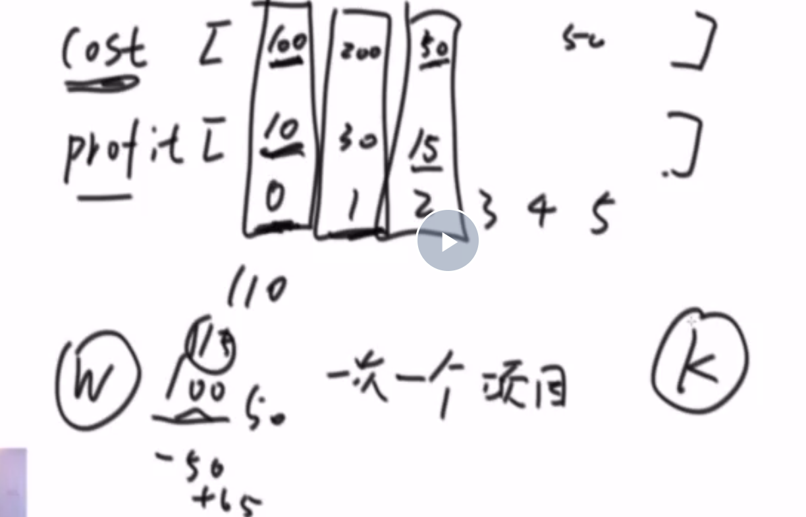

# 贪心算法
1，字符串数组 
拼接所有字符串，找到拼接字典序最小的结果

**字典序**： 理解成多少位进制的数，

贪心算法：在某一规则下，进行排名；

比较策略就是贪心策略
找排序策略，比较策略要具有传递性。

2，一块金条切成两半，是需要花费和长度数值一样的铜板的。比如长度为20的金条，不管切成长度多大的两半，都要花费20个铜板。一群人想整分整块金条，怎么分最省铜板？
例如给定数组10.20.30，代表一共三个人，整块金条长度为10+20+30=60.金条要分成10.20.30三个部分。如果，先把长度60的金条分成10和50，花费60再把长度50的金条分成20和30，花费50一共花费110铜板。
但是如果，先把长度60的金条分成30和30，花费60再把长度30金条分成10和20，花费30一共花费90铜板。
输入一个数组，返回分割的最小代价。

解析：**哈夫曼编码**

用**小根堆**实现。

3，项目投资

解题思路：用两个堆实现，分别是小根堆和大根堆

4，安排会议  52分钟
一些项目要占用一个会议室宣讲，会议室不能同时容纳两个项目的宣讲。给你每一个项目开始的时间和结束的时间（给你一个数组，里面是一个个具体的项目），你来安排宣讲的日程，要求会议室进行的宣讲的场次最多。返回这个最多的宣讲场次。

贪心策略：早结束